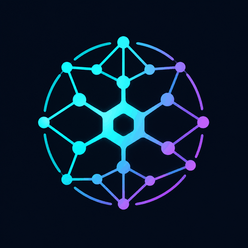

<p align="center">
  
</p>

# Ariad — Codebase Memory V2

> **Hybrid code intelligence** — native WASM indexer (112 languages) + human memory graph + Obsidian vault sync.
> V1 (C engine, 158 languages) remains an optional, separately run database producer and reference; V2 never launches it automatically.

[](https://github.com/Cheurteenyt/Ariad/actions/workflows/ci.yml)
[](LICENSE)

## What is this?

Codebase Memory V2 is a **hybrid** code intelligence system:

1. **Native WASM indexer** (V2) — 112 languages via tree-sitter WASM grammars. The most advanced semantic precision on TypeScript/JavaScript: cross-file CALLS resolution, directed file imports, module validity lock, type/value default separation, builtin truth lock. Semantics version 9.

2. **Human memory graph** (V2) — ADRs, bug notes, refactor plans, conventions, legacy zone markers, risk assessments, activity journal — synced to an Obsidian-compatible Markdown vault.

3. **V1 C engine** (separate producer/reference) — 158 languages via tree-sitter C. If an operator runs V1 separately, V2 can read the resulting compatible SQLite database via `CodeGraphReader`.

V2 performs native indexing without invoking V1. It does not automatically fall back to V1, merge V1 and V2 output, or create a V1 database on demand.

## Lineage and attribution

Ariad / Codebase Memory V2 was initially inspired by
[DeusData/codebase-memory-mcp](https://github.com/DeusData/codebase-memory-mcp):
in particular, its local persistent code graph, structural MCP queries, and
interactive graph exploration. Ariad V2 is a separate TypeScript, Node.js, and
WASM implementation maintained independently; it is not an official DeusData
release and is not affiliated with that project.

`v1-reference/` preserves a frozen compatibility and benchmark snapshot of the
upstream project at commit
[`345425a1bbf73fa29f76067a91f6d16dcf6f11a8`](https://github.com/DeusData/codebase-memory-mcp/tree/345425a1bbf73fa29f76067a91f6d16dcf6f11a8).
That snapshot is not part of the active V2 runtime. Its original MIT notice is
preserved in [`v1-reference/LICENSE`](v1-reference/LICENSE); Ariad's own code is
licensed separately under the root [MIT license](LICENSE).

## Measured competitive position

The current [Ariad versus Graphify truth audit](docs/performance/reports/R184_ARIAD_VS_GRAPHIFY_TRUTH_AUDIT_2026-07-24.md)
does not declare a universal winner. On the pinned corpus, Ariad indexes and
rechecks repositories substantially faster, keeps no-change graph counts and
artifact sizes stable, and exposes exact bounded freshness and failure
metadata. Graphify remains lighter on small indexing workloads and reaches its
static visualization sooner; Graphify plus Obsidian also leads the measured
minimum-edit-context task. Every arm failed the rationale-retrieval task.

Ariad is therefore aimed at repeated safe-change preparation on a living
repository, not at replacing optimized source lookup or copying Graphify's
visual language. Use exact source inspection for cheap literals, and consult
the report before making token, correctness, or Graph UI claims.

## Current version

See `v2/package.json` and `v2/CHANGELOG.md` for the authoritative version, test counts, and bug/optimization history.

## Quick start

Requires Node.js >= 22.12.0. The repository's `.nvmrc` and `.node-version`
select Node 24 LTS for development.

```bash
cd v2
npm ci

# Backend CLI + MCP server only
npm run build
npm test                    # see v2/CHANGELOG.md for current test count

# Index a project natively (no V1 needed for TS/JS)
node dist/cli/index.js index --project my-app --root /path/to/repo
node dist/cli/index.js index --project my-app --root /path/to/repo --incremental

# Try the demo
node dist/cli/index.js demo

# Initialize your project
node dist/cli/index.js init --project my-app

# Run diagnostics
node dist/cli/index.js doctor --project my-app

# Build the complete package, including the Graph UI, before starting it
npm run build:package
node dist/cli/index.js ui --project my-app
# Permit Control to browse/index a repository outside your home directory
node dist/cli/index.js ui --project my-app --allowed-root /srv/repos
```

`npm ci` installs dependencies but does not put this package's own `cbm-v2`
binary on your `PATH`. Use `node dist/cli/index.js` from a source checkout, as
above, or run `npm link` once if you prefer the shorter `cbm-v2` command.

## CLI reference

### Core commands

| Command | Description |
|---|---|
| `cbm-v2 index --project <p> --root <r>` | Index a project natively (WASM, 112 languages) |
| `cbm-v2 index --project <p> --root <r> --incremental` | Fast incremental index (skip unchanged files) |
| `cbm-v2 index --project <p> --root <r> --dry-run` | Preview without writing to DB |
| `cbm-v2 init` | Initialize `.codebase-memory.json` configuration |
| `cbm-v2 doctor` | Run diagnostics (Node version, DB, vault path) |
| `cbm-v2 stats` | Show a pretty statistics dashboard |
| `cbm-v2 demo` | Create a demo project with sample notes + vault |
| `cbm-v2 mcp` | Run as MCP server (JSON-RPC over stdio) |
| `cbm-v2 ui [--allowed-root <paths...>]` | Start the graph UI web server (port 9749); optionally allow additional local browse/index roots |
| `cbm-v2 watch` | Watch vault for changes and auto-sync (daemon) |

Drive-scale indexes add `--exclude <names...>` (cache/system volumes) and
`--discovery-tolerant` (ACL denials become warnings). The full option list and
the human memory, Obsidian, report, and backup commands live in the
[CLI reference](docs/reference/CLI_REFERENCE.md) — the single source of truth
for command flags.

## MCP tools (8)

The `cbm-v2 mcp` command exposes 8 tools via JSON-RPC 2.0 over stdio:
`get_project_overview`, `get_module_context`, `get_undocumented_hotspots`,
`create_human_note`, `link_note_to_code_node`, `search_code_and_memory`,
`lookup_source_text`, `prepare_edit_context`. Contracts, parameters, and
examples are documented in the
[MCP tools reference](docs/reference/MCP_TOOLS.md) — the single source of
truth for tool behavior.

### Connecting an AI agent

Add to your MCP client config (Claude Desktop, Cursor, Zed, etc.):

```json
{
  "mcpServers": {
    "codebase-memory-v2": {
      "command": "node",
      "args": ["/absolute/path/to/Ariad/v2/dist/cli/index.js", "mcp", "--project", "my-app"]
    }
  }
}
```

For Codex, add a local STDIO server to `~/.codex/config.toml` or to a trusted
project's `.codex/config.toml` after running `npm run build`:

```toml
[mcp_servers.codebase_memory_v2]
command = "node"
args = ["/absolute/path/to/Ariad/v2/dist/cli/index.js", "mcp", "--project", "my-app"]
```

On Windows, the global file is `%USERPROFILE%\.codex\config.toml`. Use an
absolute path with forward slashes, for example
`D:/Ariad/v2/dist/cli/index.js`, or escape each backslash in
the TOML string. Restart Codex after editing the configuration, then use
`codex mcp list` or `/mcp` to verify the connection.

## How it works

```
┌──────────────────────────────────────────────────────────────┐
│  Codebase Memory V2 (hybrid)                                 │
├──────────────────────────────────────────────────────────────┤
│                                                              │
│   ┌─────────────────────────┐  ┌──────────────────────────┐  │
│   │  V2 Native Indexer      │  │  V1 C Engine (separate)  │  │
│   │  tree-sitter WASM       │  │  tree-sitter C           │  │
│   │  112 languages          │  │  158 languages           │  │
│   │  cross-file resolver    │  │  DB producer/reference   │  │
│   │  semantics v9           │  │                          │  │
│   └───────────┬─────────────┘  └──────────┬───────────────┘  │
│               │                           │                  │
│               v                           v                  │
│   ┌─────────────────────────────────────────────────────────┐│
│   │  SQLite code graph (produced by one indexer per run)    ││
│   └─────────────────────────────────────────────────────────┘│
│               │                                              │
│               v                                              │
│   ┌─────────────────────────────────────────────────────────┐│
│   │  V2 Human Memory Layer                                  ││
│   │  Human Memory DB • Obsidian vault sync • Graph UI       ││
│   │  8 MCP tools • Reports • Intelligence layer             ││
│   └─────────────────────────────────────────────────────────┘│
│                                                              │
│   Storage:                                                   │
│   ~/.cache/codebase-memory-mcp/                              │
│     <project>.db           ← code graph (V2 or separate V1)  │
│     <project>.human.db     ← human memory (V2, TS)           │
│   <repo>/.codebase-memory-vault/  ← Obsidian vault (MD)      │
│   <repo>/.codebase-memory.json    ← project config           │
└──────────────────────────────────────────────────────────────┘
```

## Native indexer (V2 WASM)

V2 includes a **native code indexer** that does NOT require the V1 C binary:

- **112 languages** via pre-built tree-sitter WASM grammars (`tree-sitter-wasm`)
- **Cross-file CALLS resolution** — persistent `call_sites`, `imports`, `exports` tables; resolver matches call-sites to definitions across files
- **Directed file imports** — exact deduplicated File-to-File `IMPORTS` edges with resolution, confidence, binding, and import-kind evidence, including portable NodeNext `.js`-to-TypeScript resolution
- **Module validity lock** — detects duplicate exports, default marker collisions, unresolved star sources, invalid builtins
- **Type/value default separation** — `interface`/`type alias` defaults excluded from runtime count
- **Builtin truth lock** — `isBuiltin()` from `node:module`; `node:fake` rejected, `node:test` accepted
- **Incremental indexing** — content hash + mtime_ns fast-skip; deletion-only fast path
- **Parallel workers** — multi-threaded WASM parsing for large projects
- **Semantics versioning** — `CURRENT_EXTRACTOR_SEMANTICS_VERSION = 9`; incremental mode forces full reindex when extractor output changes
- **Discovery completeness lock** — `DiscoveryResult` with structured errors; partial discovery preserves the existing graph (no silent wipe)
- **Config-driven discovery excludes** (`0.78.0-alpha.2`) — the `exclude` field of `.codebase-memory.json` plus the repeatable `--exclude <name>` flag skip directories by name (case-insensitive, any depth, symlink targets included) in addition to the built-in policy; drive-scale indexes exclude cache/system volumes
- **Tolerant discovery** (`0.78.0-alpha.2`) — `--discovery-tolerant` turns ACL denials (EACCES/EPERM) into warnings + uncertain paths that incremental runs never treat as deleted, so whole-drive sweeps are not blocked by `pagefile.sys`, other user profiles, or locked app caches
- **Canonical root propagation** — symlinked roots produce `file_path` without `..`
- **File identity contract** — `dev:ino` dedup with `0:0` fallback; deterministic hardlink selection

### Limitations

- V2 native indexer is most precise on **TypeScript/JavaScript**. Other languages (Python, Go, Rust, etc.) are parsed structurally but without cross-file resolution.
- For V1's 158-language coverage and precision, run the V1 C binary separately to produce the project database before opening it from V2.
- The Graph UI overview is capped at 1,000 representatives for predictable
  transfer and simulation cost. Exact domain, community, and directory scopes
  are loaded in revision-bound pages; the full project is never transferred
  merely to inspect one scope. Selecting a community opens its exact symbols
  immediately, while the filesystem tree requests a distinct directory
  subtree so an identically named layout community cannot replace it.

## Human memory node types

| Label | Obsidian dir | Description |
|---|---|---|
| `ArchitectureNote` | `Architecture/` | Transverse architecture notes |
| `ADR` | `ADR/` | Architecture Decision Records |
| `BugNote` | `Bugs/` | Known bugs |
| `RefactorPlan` | `Refactor/` | Planned refactors |
| `LegacyNote` | `Legacy/` | Legacy zone markers |
| `Convention` | `Conventions/` | Coding/architecture conventions |
| `Prompt` | `Prompts/` | Useful prompts for AI agents |
| `JournalEntry` | `Journal/` | Activity journal |
| `ModuleNote` | `Modules/` | Notes attached to modules |
| `RouteNote` | `Routes/` | Notes attached to HTTP routes |
| `RiskNote` | `Architecture/` | Risk assessments |

## Vault format

Each note has two sections:

```markdown
---
type: adr
status: active
cbm_node_ids: [1234]
tags: [auth, security]
---

# ADR-001: Use JWT for authentication

## AUTO-GENERATED

> ⚠️ This section is controlled by Codebase Memory V2 and may be regenerated.
> Do not edit — your changes would be lost on the next sync.

### Metadata
- **Type**: ADR
- **Status**: active
- **Slug**: adr-001-use-jwt-for-authentication

### Links to code
- [[1234]] — Module:auth (`src/auth/index.ts:1`)

---

## HUMAN NOTES

> ✏️ This section belongs to the user. It will **never** be overwritten.

### Context
We needed a stateless auth mechanism.

### Decision
Use JWT tokens signed with HS256.
```

The `## HUMAN NOTES` section is **never** overwritten by V2. Edit it freely in Obsidian — the next sync preserves your edits.

## Graph UI

The V2 graph UI replaces V1's separate 3D Three.js scene with one bounded 2D
d3-force canvas and two task views over the same graph: **Structure** (default;
server-authored domain/community anchors, bounded captions, and progressive
zoom down to individual symbols) and **Dependencies** (exact-degree hubs over a
bounded dependency atlas), plus on-demand revision-bound **exact scope** pages
and a shortest **coupling path** explainer. Both views share one topology, one
d3 simulation, filters, the keyboard model, and the detail APIs; the Projects
and Control tabs cover project health and system/index controls.

Durable design detail lives in the
[Graph UI contributor guide](graph-ui/README.md) and
[V2 Architecture §9](docs/architecture/V2_ARCHITECTURE.md#9-graph-ui) — this
README keeps only the quick start.

```bash
# From v2/ in a source checkout
npm run build:package
node dist/cli/index.js ui --project my-app

# Or, after npm link / a global install
cbm-v2 ui --project my-app --port 8080
# Add repositories outside the user's home directory to the Control allowlist
cbm-v2 ui --project my-app --allowed-root /srv/repos /mnt/work
```

Open `http://127.0.0.1:9749/` for the project selector, or go directly to
`http://127.0.0.1:9749/?tab=graph&project=my-app` for the interactive graph.
The home directory and the selected project's indexed root are allowed by
default. Additional Control-tab browse/index roots must be granted explicitly
with `--allowed-root`; paths are canonicalized before containment checks.

## Docker

```bash
# Build
docker build -t cbm-v2 .

# Run CLI
docker run --rm cbm-v2 --help
docker run --rm cbm-v2 demo

# Run MCP server (mount cache volume)
docker run --rm -i -v cbm-cache:/home/node/.cache/codebase-memory-mcp cbm-v2 mcp --project my-app
```

## Documentation

Use the [documentation portal](docs/README.md) to choose the canonical source
for architecture, reference, operations, performance evidence, or history.
The primary entry points are:

- [Current product state](docs/reference/V2_CURRENT_STATE.md)
- [CLI reference](docs/reference/CLI_REFERENCE.md)
- [MCP tools reference](docs/reference/MCP_TOOLS.md)
- [Graph UI development](graph-ui/README.md)
- [Contributing](CONTRIBUTING.md) and [maintaining](MAINTAINERS_GUIDE.md)

## Security

- **Local-first**: no network calls, no telemetry
- **HUMAN NOTES preserved**: the `## HUMAN NOTES` section is never overwritten (regression-tested)
- **Path traversal protection**: `obsidian_path` validated against `..` and backslashes; `assertPathInsideRoot` uses `path.relative` for cross-platform containment
- **Discovery completeness lock**: partial discovery (subtree EACCES, fatal symlink errors) preserves the existing graph — no silent wipe. Broken symlinks (ENOENT) are treated as warnings, not fatal. With `--discovery-tolerant` (`0.78.0-alpha.2`), ACL denials become warnings too, and their paths are recorded as uncertain so incremental runs never treat them as deleted.
- **Config-driven excludes** (`0.78.0-alpha.2`): the `exclude` field of `.codebase-memory.json` (loaded from the index root) and the `--exclude <name>` flag are matched case-insensitively against every path component — system and cache volumes never enter the graph.
- **Alias history** (R153): when a symlink alias was previously valid and is now broken, the old canonical target's data is preserved via the `alias_history` table. Prevents silent historical-target deletion.
- **Warning propagation** (R152+R153): all discovery warnings (broken symlinks, ELOOP, TOCTOU races) are surfaced in `IndexResult.warnings` with root-relative paths. The CLI prints them even on success (`SUCCESS_WITH_WARNINGS` outcome).
- **Typed outcome** (R153): `IndexResult.outcome` is `SUCCESS` | `SUCCESS_WITH_WARNINGS` | `STALE` | `PARTIAL` | `FAILED`. Exit codes: 0 (success), 1 (errors), 2 (stale without errors).
- **Root discovery validation**: `assertDiscoveryRoot` verifies stat + isDirectory + realpath + readdir before any DB mutation
- **Backup rotation**: max 5 `.bak` files per note
- **Dry-run**: available on `obsidian sync`, `obsidian export`, `obsidian import`, `backup import`
- **Consistent sync hashes**: `markSynced` computes the same DB-derived hash for both export and import directions, making conflict detection reliable (R14 fix)

## Performance

- **N+1 query elimination**: all hot paths use bulk fetches (`getBulkNotesByCbmNodeIds`, `getBulkNodeDegrees`, `getBulkEdges`)
- **SQL-level limit**: `getBulkNotesByCbmNodeIds` uses `ROW_NUMBER() OVER (PARTITION BY ...)` to cap per-node at the database level
- **Incremental indexing**: content hash + mtime_ns fast-skip; deletion-only fast path avoids re-parsing unchanged files
- **Parallel workers**: multi-threaded WASM parsing for projects with >20 changed files
- **Stable UI listeners**: `GraphCanvas` uses refs for callbacks — no listener rebinds on filter toggle

## License

MIT — see [LICENSE](LICENSE).
